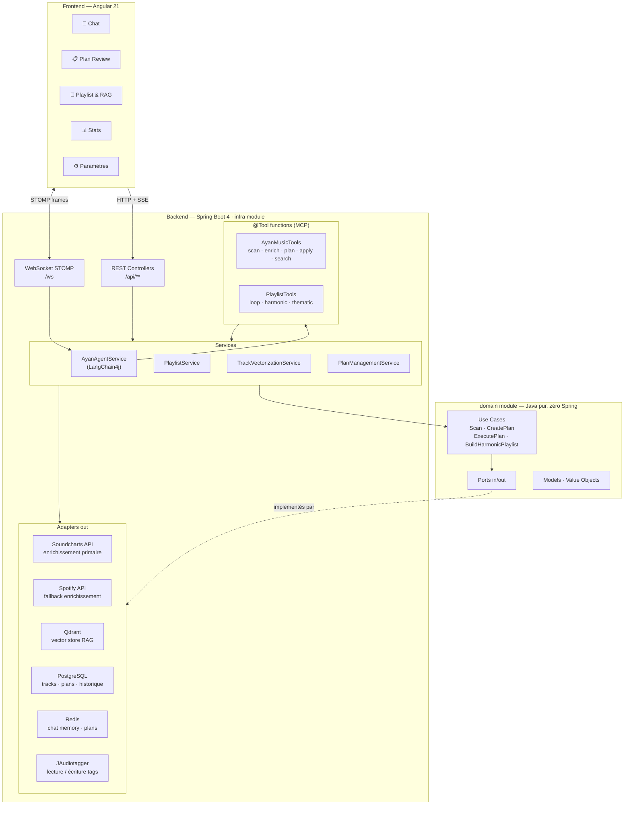
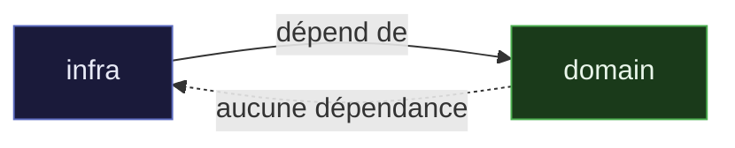
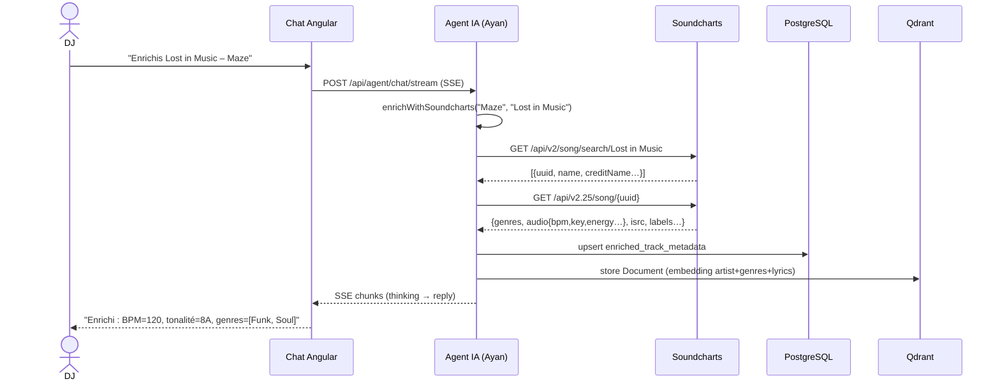
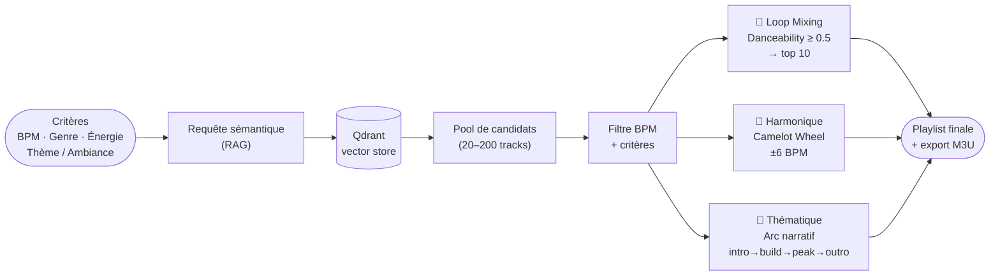
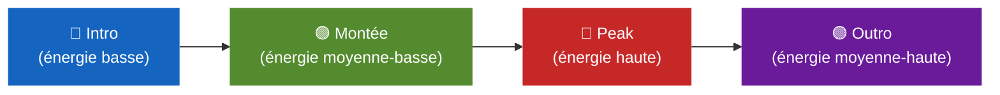
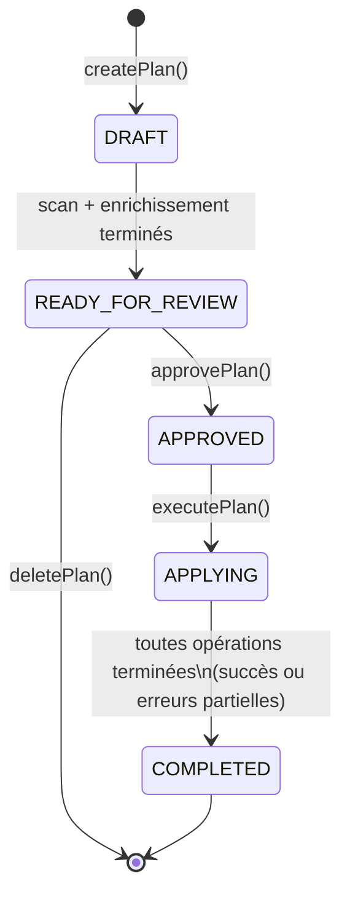
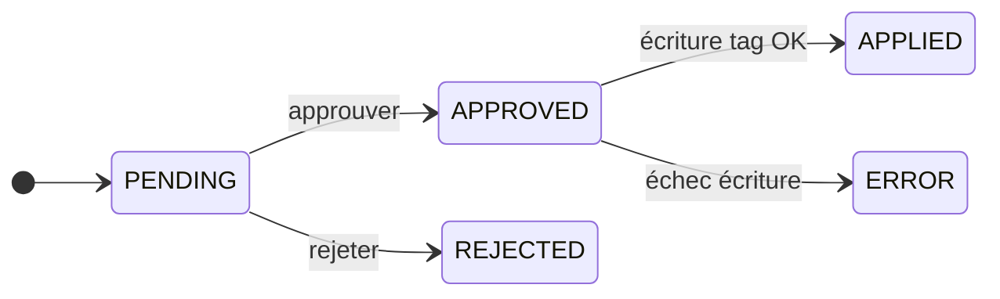

# Ayan DJ Tools

Application pour DJs — enrichissement automatique des tags audio via un agent IA (Ayan).
Scanne les fichiers audio, détecte les tags manquants, enrichit les métadonnées via Soundcharts,
génère des playlists harmoniques et thématiques, et propose les modifications en mode Plan, Manuel ou Auto.

## Prérequis

| Outil | Version minimale |
|-------|-----------------|
| Java (JDK) | 25 |
| Node.js | 22+ |
| Docker Desktop | 27+ |
| Git | 2.x |

---

## Architecture



### Séparation domain / infra

Le module `domain` ne connaît ni Spring, ni JAudiotagger, ni aucun framework tiers.
Le module `infra` dépend de `domain` et fournit toutes les implémentations concrètes via `DomainConfig`.



---

## Flux d'enrichissement



---

## Génération de playlists

Les trois types de playlist partagent le même pipeline RAG → filtre → séquençage :



### Arc narratif (playlist thématique)

Les tracks triés par énergie croissante sont répartis en 4 quartiles puis reordonnés :



---

## Cycle de vie d'un plan



Chaque `TagOperation` dans le plan a son propre statut :



---

## Démarrage rapide

### 1. Services Docker (PostgreSQL, Redis, Qdrant, Ollama)

```bash
docker-compose up -d

# Télécharger les modèles IA après le démarrage
docker exec -it dj-tagger-ollama ollama pull llama3.1:8b
docker exec -it dj-tagger-ollama ollama pull nomic-embed-text
```

### 2. Backend Spring Boot

```bash
./gradlew infra:bootRun
```

### 3. Frontend Angular

```bash
cd ayan_dj_tools_web
npm install
npm start          # http://localhost:4200
```

---

## Configuration

### Clés API

Les clés se configurent depuis l'interface → Paramètres (`Ctrl+,`).
Elles peuvent aussi être fournies via variables d'environnement avant de lancer le backend :

| Variable | Service | Rôle |
|----------|---------|------|
| `SOUNDCHARTS_APP_ID` | Soundcharts | Enrichissement métadonnées (source primaire) |
| `SOUNDCHARTS_API_KEY` | Soundcharts | Enrichissement métadonnées (source primaire) |
| `SPOTIFY_CLIENT_ID` | Spotify | Enrichissement (fallback si Soundcharts indisponible) |
| `SPOTIFY_CLIENT_SECRET` | Spotify | Enrichissement (fallback) |
| `TAVILY_API_KEY` | Tavily | Recherche web dans l'agent (`lookupMusicInfo`) |

Sans ces clés, l'agent fonctionne en mode dégradé (scan local uniquement, pas d'enrichissement externe).

---

## Ports utilisés

| Service | Port | Protocole |
|---------|------|-----------|
| Backend Spring Boot | 8000 | HTTP / WebSocket STOMP |
| SwaggerUI / OpenAPI | 8000 | HTTP (`/docs`, `/api-docs`) |
| PostgreSQL | 5432 | TCP |
| Redis | 6379 | TCP |
| Qdrant (REST) | 6333 | HTTP |
| Qdrant (gRPC) | 6334 | gRPC |
| Ollama | 11434 | HTTP |

---

## Écrans de l'application

### Chat — écran d'accueil (`/`)

Interface de conversation avec l'agent IA Ayan en langage naturel.

Capacités principales :
- **Scanner** des fichiers audio et **détecter les tags manquants**
- **Suggérer** artiste/titre à partir du nom de fichier
- **Enrichir** les métadonnées via Soundcharts (BPM, tonalité, genres, paroles, popularité…)
- **Créer un plan** de modifications, puis **prévisualiser** et **appliquer** les tags (backup + rollback)
- **Consulter l'historique** des modifications
- **Rechercher des morceaux par critères** en langage naturel — genre, BPM, énergie, années, ambiance.
  Ex. : *« donne-moi 10 morceaux house énergiques entre 120 et 130 BPM »*
- **Rechercher des morceaux similaires** (RAG sémantique via Qdrant)
- **Générer des playlists** — loop mixing, mix harmonique Camelot ou arc thématique
- **Rechercher des informations musicales** (artiste, album, morceau) via Soundcharts + web

### Plan (`/plan/:id`)

Révision du plan de tagging proposé par l'agent. Trois modes selon la préférence choisie :

| Mode | Comportement |
|------|-------------|
| **Plan** | Liste complète des opérations à approuver/rejeter, puis exécution en lot. |
| **Manuel** | Fichier par fichier, avec progression STOMP en temps réel. |
| **Auto** | Exécution automatique avec log de progression animé. |

### Playlist & RAG (`/playlist`) — `Ctrl+L`

- **Playlist Thématique** — arc narratif basé sur les paroles et l'ambiance analysées.
  Ex. : *liberté danse africa*, *mélancolie pluie*, *été festif soleil*.
- **Génération Playlist (loop mixing)** — filtres BPM min/max + genre, tri par danceability.
- **Mix Harmonique (Camelot)** — séquençage façon *Mixed In Key* avec badges de clé Camelot,
  types de transitions (`PERFECT_MATCH`, `ADJACENT_KEY`, `MODE_CHANGE`, `JUMP`) et stats globales.
- **Recherche Similaire (RAG)** — requête texte libre avec score de similarité.

### Historique (`/history`) — `Ctrl+H`

Recherche par ID de plan. Diff complet des tags (avant / après) avec statut par fichier.

### Statistiques (`/stats`) — `Ctrl+S`

| Onglet | Contenu |
|--------|---------|
| **Collection** | Pistes scannées/enrichies, distribution genres, histogramme BPM, Camelot Wheel. |
| **Enrichissement** | Taux de correspondance Soundcharts, taux d'erreur, tags enrichis par type. |
| **Activité** | Tags appliqués par période, utilisation des modes, plans créés. |

### Paramètres (`/settings`) — `Ctrl+,`

- URL API backend (configurable dynamiquement)
- Clés API (Soundcharts, Spotify, Tavily) — masquées après enregistrement
- Mode par défaut (Plan / Manuel / Auto)
- Basculement thème sombre/clair · Langue (Français / English)
- Export / import configuration JSON

---

## Développement

### Backend

```bash
./gradlew build                  # build complet
./gradlew test                   # tous les tests
./gradlew domain:test            # domaine pur (sans Spring)
./gradlew infra:test             # Spring + Testcontainers
./gradlew infra:bootRun          # lancement dev
./gradlew infra:bootJar          # JAR de distribution → infra/build/libs/
```

### Frontend

```bash
cd ayan_dj_tools_web
npm install
npm start        # dev (localhost:4200, proxy → localhost:8000)
npm run build    # production
npm test         # vitest
```

---

## Raccourcis clavier

| Raccourci | Action |
|-----------|--------|
| `Ctrl+P` | Chat (accueil) |
| `Ctrl+H` | Historique |
| `Ctrl+S` | Statistiques |
| `Ctrl+L` | Playlist & RAG |
| `Ctrl+,` | Paramètres |
| `Ctrl+O` | Ouvrir fichiers |
| `?` | Aide raccourcis |
